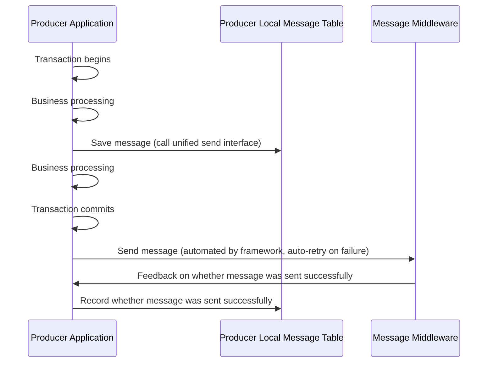
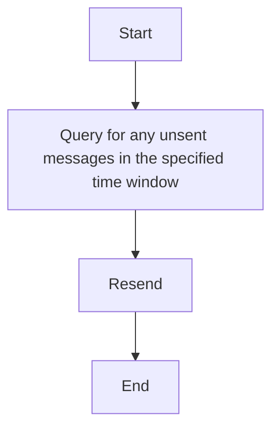
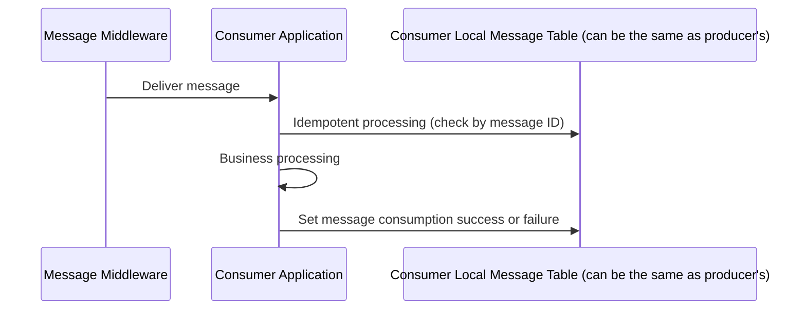
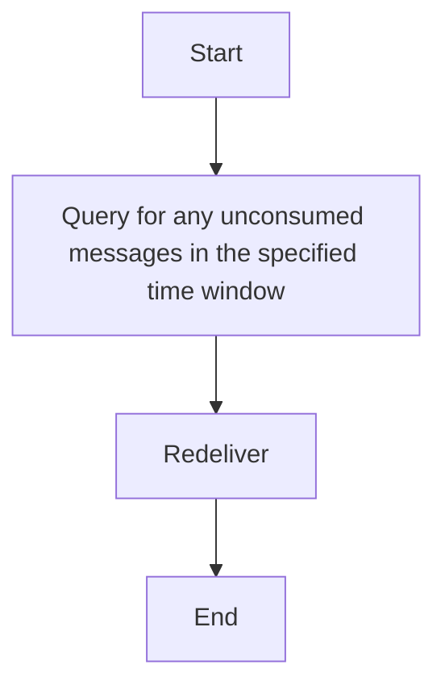

# rabbitmq-springboot-mybatisplus-reliable

## Introduction
This framework is designed for scenarios where "a single message is consumed by only one node within a cluster", solving RabbitMQ's message reliability issues in this mode: ensuring messages are delivered and each message is consumed idempotently only once.
It supports Spring Boot + MyBatis-Plus technology stack, JDK 17 and above.

If this project is helpful to you, please give it a Star for support, thank you very much!

## Terminology
Message ID: The message ID mentioned in this document refers to the custom message ID (corresponding to the id field in the database table), which is different from RabbitMQ's own message ID. The generation rule is prefix (configured by mq.id-prefix on the sender side) + 32-bit uuid.
The message ID will be output to error logs. During consumption, when not using the same message table, you can determine where the message comes from based on the message ID for re-sending.

## Solution
Save to database first then send message + failure compensation mechanism (sender ensures successful sending, RabbitMQ delivery guarantees at-least-once delivery, consumer ensures successful consumption)

#### Sending Issues
- Problems:
    1. Message is called for sending but not successfully sent (should send but not sent), because calling the sending interface only means the message has arrived at the broker, and does not indicate that the RabbitMQ Broker has routed and persisted this message. At this time, the message is in a "transit" state. However, changing to synchronous sending would result in poor performance.
    2. Business fails but message is sent out (send when should not send).
- Solution: Users send messages through the unified interface xyz.zhenliang.rabbitmq.sender.IRabbitmqSender.sendMessage.
    - Sending: Local message table (saved in transaction) + send message after transaction commit + spring's built-in sending retry + asynchronous confirmation + sending failure notification interface.
    - Monitoring: Query of failed message sending count.
    - Remediation: Failed message query (message table) interface + resend message interface + delete message interface
- Process:
    1. When sending, save the message to the message table, using a custom message ID (you can set a prefix for the message ID to determine which service it comes from based on the message id)
    2. Asynchronously confirm the message, save the confirmation result to the message table
    3. After the database transaction commits, perform the message sending operation. There are two purposes: first, to ensure it's in the same transaction as the business, preventing business failure but message being sent out; second, to ensure the message is saved to data before confirmation message can be received
    4. If message sending fails (message is not sent to broker, calling the sending interface will fail), use springboot mechanism to resend, if retry fails, record as sending failure
    5. If message confirmation fails, record as sending failure
    6. Notification, transfer to manual processing
        - Batch notification, statistics for messages that have not been successfully sent beyond specified time, framework provides query interface.
        - Single message sending failure, system provides notification interface, implement interface bean, notify when failed.
    7. Manual remediation: Provide message resending, query failed message count, query failed message sending interface
    8. Logging, will include message id. Message sending failure, log level is error. Message sending success, log level is info.


Sending Logic


Fallback sending logic



#### Consuming Issues
- Issues:
    1. The same message may be consumed multiple times. RabbitMQ guarantees "at least once delivery" rather than "exactly once delivery"
    2. Message consumption failure, one retry might be enough.
- Solution: Users consume by inheriting the unified abstract class xyz.zhenliang.rabbitmq.demo.consumer.listener.AbstractRabbitmqConsumer and implementing the handleData method inside.
    - Consumption: Idempotent consumption based on local message table (save received messages, do not save if already exists; record consumption success or failure) + Dead letter queue (manual handling required in case of database downtime) + Spring's built-in consumption retry + Consumption failure notification interface.
    - Monitoring: Dead letter queue message count query + Consumption failure message count query.
    - Remediation: Dead letter queue to message table conversion (recovery) + Delete dead letter queue messages + Consumption failure query (message table) interface + Resend message interface + Delete message interface.
- Process:
    1. Perform idempotent check on messages, determine whether the message has already been processed based on custom message id, ignore if processed. If the message does not exist in the message table (consumer and sender are not in the same database), add it.
    2. If an exception occurs during idempotent judgment (database downtime), the message will be transferred to the dead letter queue
    3. Retry using Spring Boot's built-in message consumption retry mechanism
    4. Notification, transfer to manual handling
       - Batch notification, count messages that have not been successfully consumed over a specified time period, framework provides query interface.
       - Consumption failure notification, need to implement notification interface.
    5. Manual remediation: Provide message resending interface, transfer dead letter queue messages to message table (in case of database downtime, messages will be transferred to dead letter queue), interface for obtaining consumption failure messages, delete message interface
    6. Logging, will include message id. Message sending failure, log level is error. Message consumption success, log level is info.

Consumption logic:


Fallback consumption logic
1. Dead letter queue messages (messages that fail to be stored in the consumer end will be transferred to the dead letter queue), transfer messages to the database through the interface
2. Consumption failure messages



## Usage Instructions
1. Initialize the database: Execute the script sql/mysql_init.sql, please write other database scripts yourself; handwritten SQL is not used in the framework source code
2. Add dependencies: Add the following content to pom.xml, such as using version 1.0.0

```
<dependency>
    <groupId>xyz.zhenliang.rabbitmq</groupId>
    <artifactId>rabbitmq-springboot-mybatisplus-reliable</artifactId>
    <version>1.0.0</version>
</dependency>
```

But you need to have mybatis-plus and springboot-amqp dependencies beforehand

```
<dependency>
    <groupId>com.baomidou</groupId>
    <artifactId>mybatis-plus-boot-starter</artifactId>
    <version>${mybatis-plus.version}</version>
</dependency>
<dependency>
    <groupId>org.springframework.boot</groupId>
    <artifactId>spring-boot-starter-amqp</artifactId>
</dependency>
```

3. Spring Boot configuration
   Among them, spring.template.retry.enabled must be true. Otherwise, the framework will not load.

```
mq:
  id-prefix: demo  # Unified prefix for message IDs
spring:
    rabbitmq:
    host: localhost
    port: 5672
    username: admin
    password: Demo123
    # Virtual host, default is "/"
    virtual-host: /
    # Enable message confirmation mechanism
    publisher-confirm-type: correlated
    publisher-returns: true
    listener:
      simple:
        # Manually acknowledge messages
        acknowledge-mode: manual
        # Number of messages prefetched by a single consumer, default is 250 in Spring Boot
        prefetch: 10
        # Consumer concurrency settings
        concurrency: 1
        max-concurrency: 10
        # Consumer retry configuration
        retry:
          enabled: true
          max-attempts: 3
          initial-interval: 1000ms
          multiplier: 2.0
          max-interval: 10000ms
    template:
      # Send retry configuration
      retry:
        enabled: true       # Master switch: whether to enable retry mechanism
        initial-interval: 1000ms  # Initial retry interval (wait 1 second after first failure)
        multiplier: 2       # Interval multiplier (next interval = previous interval * multiplier)
        max-attempts: 3     # Maximum retry attempts (including the initial send, total 3 attempts)
        max-interval: 10000ms # Maximum retry interval (no matter how large the calculated value is, it won't exceed 10 seconds)
      # When unable to route to queue, return processing, ReturnCallback will be executed
      mandatory: true
```

4. Message sending: Inject the bean of xyz.zhenliang.rabbitmq.sender.IRabbitmqSender and call the unified sending interface. The interface will

```
@Autowired
private IRabbitmqRescue rabbitmqRescue;
```
API Specification
```
    /**
     * Send message to the specified exchange and routing key
     *
     * @param exchange Exchange name
     * @param routingKey Routing key
     * @param data Message data
     * @param businessId Business ID
     * @param extraInfo Extra information
     * @param <T> Generic type of message data
     * @return RabbitmqMsgDTO object containing message information
     */
    public <T> RabbitmqMsgDTO<T> sendMessage(String exchange, String routingKey, T data, String businessId, String extraInfo);
```

5. Message Consumption:
   Extend the xyz.zhenliang.rabbitmq.demo.consumer.listener.AbstractRabbitmqConsumer abstract class and implement the handleData method.
   Example of inheriting the interface:
```
public class OrderListener extends AbstractRabbitmqListener<OrderDTO>
```

Implementation method:
```
/**
 * Business method for processing message DTO data
 *
 * @param msgDTO Message DTO object containing message ID, business data and other information
 */
public void handleData(RabbitmqMsgDTO<T> msgDTO)
```


6. Notification Interface Implementation
   You need to implement the interface xyz.zhenliang.rabbitmq.reminder.IRabbitmqReminder and register it as a bean.
   Interface methods

```
    /**
     * Send failure notification method
     * This method is called when message sending fails to provide notification
     */
    default void sendFailedReminder(String messageId, String messageBody,String errorMessage) {

    }
    
    /**
     * Consumption failure notification method
     * This method is called when message consumption fails to provide notification
     */
    default void consumeFailedReminder(String messageId,String messageBody,String errorMessage) {

    }
```

Implementation example: register as a bean via @Service
```
@Service
public XXX implements IRabbitmqReminder {}
```

7. Manual rescue interface, see xyz.zhenliang.rabbitmq.rescue.IRabbitmqRescue
   Inject into your own code to use

```
@Autowired
private IRabbitmqRescue rabbitmqRescue;
```

Includes the following methods:

```
    /**
     * Resend a message by message ID
     * @param messageId Message ID
     * @return Whether the message was resent successfully
     */
    void resendMessage(String messageId);

    /**
     * Delete a message from the message table
     * @param messageId Message ID
     * @return Whether the deletion was successful
     */
    void deleteMessage(String messageId);
    
    /**
     * Get the number of messages in a specified queue
     * @param queueName Queue name
     * @return Message count, returns -1 if the queue does not exist or is inaccessible
     */
    long getDeadLetterCount(String queueName);


    /**
     * Move messages from a dead-letter queue to the message table
     * @param deadLetterQueueName Dead-letter queue name
     * @return Queue processing result, including processed count, success count, failure count, etc.
     */
    QueueProcessResult moveQueueMessagesToMsgTable(String deadLetterQueueName);

    /**
     * Purge all messages from a specified queue
     * @param queueName Queue name
     */
    void purgeQueue(String queueName);
    
    /**
     * Get the total count of failed send messages
     * @return Total count of failed send messages
     */
    long getSendFailedCount(long startSecondsAgo,long endSecondsAgo);
    
    /**
     * Paginate and get failed send messages
     * @param page Pagination parameters
     * @param startSecondsAgo Start time (seconds ago)
     * @param endSecondsAgo End time (seconds ago)
     * @return Paginated data of failed send messages
     */
    Page<RabbitmqMessage> getSendFailedPage(Page<RabbitmqMessage> page, long startSecondsAgo, long endSecondsAgo);
    
    /**
     * Get the total count of failed consume messages
     * @return Total count of failed consume messages
     */
    long getConsumeFailedCount(long startSecondsAgo,long endSecondsAgo);
    
    /**
     * Paginate and get failed consume messages
     * @param page Pagination parameters
     * @param startSecondsAgo Start time (seconds ago)
     * @param endSecondsAgo End time (seconds ago)
     * @return Paginated data of failed consume messages
     */
    Page<RabbitmqMessage> getConsumeFailedPage(Page<RabbitmqMessage> page, long startSecondsAgo, long endSecondsAgo);
    /**
     * Get a message by message ID
     *
     * @param messageId Message ID
     * @return Message entity object
     */
    RabbitmqMessage getMessageById(String messageId);
```

## Example Description

1. Deploy dependent middleware
```
cd deploy
docker compose up -d
```
2.  Initialize database
- Create database
```
CREATE DATABASE IF NOT EXISTS demo CHARACTER SET utf8mb4 COLLATE utf8mb4_unicode_ci;
use demo;
```
- Initialize data, execute script sql/mysql_init.sql

3.  Start reliable-mq-demo application
```
com.zzl.rabbitmq.demo.DemoApplication
```
4.  Interface invocation
- Access http://localhost:10000/doc.html

5. rabbitmq management interface
   http://localhost:15672/
   Username：admin
   Password：Demo123

## Other
If long-term use leads to too much data, please delete the records that have been successfully consumed by yourself.